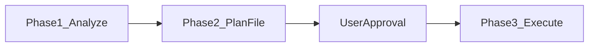

# `/testchimp cleanup` — duplicate SmartTest hygiene

Use this workflow when the user wants to **find semantically similar or likely duplicate SmartTests**, audit them, mark legitimately distinct pairs, and optionally remove true duplicates with strict guardrails.

**Standalone** (`/testchimp cleanup`) **or** as an **upkeep** subflow (default upkeep policy includes cleanup after ExploreChimp). Evolve/upkeep covers gaps + exploration + hygiene; this playbook is the cleanup step’s how-to.

> **Composite nesting:** When invoked as a subflow under `/testchimp upkeep` / `evolve`, do **not** open a second Plan → approve cycle — execute cleanup work under the parent composite’s approved plan and reuse its `workflow_execution_id`. Standalone cleanup still uses Analyze → Plan → approve → Execute below.

## When to run

- User says **`/testchimp cleanup`**, "clean up duplicate tests", "dedupe test suite", or similar.
- Periodic suite hygiene alongside evolve (see [`init-testchimp.md`](./init-testchimp.md)).

## Phase overview



Same **Analyze → Plan → Execute** gating style as evolve and test: complete each phase before continuing; get explicit user approval before Phase 3.

---

## Phase 1 — Analyze (read-only)

1. Call **`list-semantic-similar-tests`** for project root or user-specified scope:

   ```bash
   testchimp list-semantic-similar-tests --json-input '{ "scope": { "folderPath": ["tests"] } }'
   ```

   Or via MCP tool **`list-semantic-similar-tests`**.

2. Prioritize **`POTENTIAL_DUPLICATE`** pairs (similarity ≥ 0.92); note **`SIMILAR`** (≥ 0.80) for context.

3. For each candidate pair, **read both tests** (file content, suite path, intent comments). **No deletions yet.**

Response uses **TestLocators only** (no `test_id`):

```json
{
  "focusTest": {
    "folderPath": ["auth"],
    "fileName": "login.spec.ts",
    "testSuite": [],
    "testName": "user can log in"
  }
}
```

Pairs are **deduped**: focus `A` lists similar `B` only when `A.testId < B.testId` (lexicographic). Distinct-marked pairs are excluded from the default list.

---

## Phase 2 — Plan

Persist plan under:

`<MAPPED_PLANS_ROOT>/knowledge/cleanup_plans/plan_<YYYY-MM-DD>_<nn>.md`

### Required sections

1. **Analysis summary** — pair counts, top duplicate candidates.
2. **Mark distinct** — pairs to mark as legitimately different (TestLocators + rationale).
3. **Proposed deletions** — pairs judged truly duplicative (locators + which copy to keep/remove + rationale).

### Gate

Stop and request **explicit user approval** before Phase 3. Paste a short summary + plan file path.

---

## Phase 3 — Execute

### Mark distinct

For each pair in plan section 2:

```bash
testchimp mark-semantic-tests-distinct --json-input '{
  "focusTest": { "folderPath": ["auth"], "fileName": "login.spec.ts", "testName": "user can log in" },
  "distinctTest": { "folderPath": ["auth"], "fileName": "signin.spec.ts", "testName": "login flow" }
}'
```

Inform the user of each decision.

### Delete duplicates (strict guardrails)

- Only pairs listed in **approved** plan section 3.
- **Max 10 test deletions per cleanup run** — defer overflow to a future `/testchimp cleanup`.
- Never bulk-delete without named TestLocators in the approved plan.
- Use platform SmartTest delete API or file edit as appropriate for the repo.

### Verification

If deletions occurred, run affected specs.

---

## CLI reference

See [`cli.md`](./cli.md) for `list-semantic-similar-tests` and `mark-semantic-tests-distinct` flags and `--json-input` examples.

## MCP tools

| Tool | Endpoint |
|------|----------|
| `list-semantic-similar-tests` | `POST /api/mcp/list_semantic_similar_tests` |
| `mark-semantic-tests-distinct` | `POST /api/mcp/mark_semantic_tests_distinct` |

Agent marks use **`marked_by_user_id = "0"`** (distinct from real user ids in audit).
