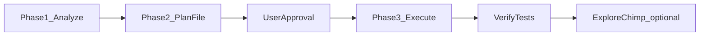

# /testchimp upkeep

**Synonym:** `/testchimp evolve` (same workflow **`upkeep`** — use either prompt). Legacy **`/testchimp audit`** → same.

> **Workflow overlay (skill ≥ 1.0.0)** — **Workflow id:** `upkeep` (canonical prompt `/testchimp upkeep`; synonym `/testchimp evolve`). **Policy:** `plans/knowledge/policies/upkeep.policy.md` (or `--policy` / matching frontmatter; fallback `ai-test-instructions.md`). Default subflows: author-plans → connect-to-test-env → fix-coverage-gaps → run-explorechimp → cleanup → instrument-truecoverage. Persist a **ULID** `workflow_execution_id` on the upkeep/evolve plan **before Execute**; on mutating actions call **`report-agent-action`** (best-effort). **Before treating the run as done:** [Report workflow execution](./policies-and-traceability.md#report-workflow-execution) (reconcile ledger → emit missing reports → `ACTION_COMPLETED` with `WORKFLOW` + `upkeep`). Details: [`policies-and-traceability.md`](./policies-and-traceability.md).

Systematically improve **requirement coverage**, **execution health**, **TrueCoverage** (real usage vs automated tests), and—when in scope—**targeted ExploreChimp UX analytics** on critical UI slices informed by those signals. This is **not** a passive review: the agent is responsible for **running and maintaining the QA surface area** of the project—seed and probe endpoints, mocks, fixtures, SmartTests and API tests, TrueCoverage instrumentation, optional **ExploreChimp** runs on high-impact journeys, and test-plan artifacts (user stories / scenarios) where the product is under-specified.

---

## Purpose and outcomes

- **Bridge signals:** (1) what the product *should* do (requirements / scenarios), (2) what tests *actually* test (execution history), (3) what users *really* do (TrueCoverage event emits in Production), (4) optional **UX risk** on the same slices via **ExploreChimp** (DOM, screenshot, console, network, metrics) along **SmartTest pathways** that reach those areas—see [ExploreChimp in evolve](#explorechimp-in-evolve-truecoverage-to-targeted-ux-runs).
- **Optimize for business impact:** Prefer gaps where analytics show **high frequency**, meaningful **drop-off**, **depth** in funnels (top-of-funnel being higher priority), or **duration** / **high-demand** events (where users engage a lot or paths are hot). When the platform exposes histograms or time series, use **percentile-style** reading (e.g. p90) alongside averages—wording should match what the API returns; do not invent metrics. Prefer percentiles over averages. Use those same signals to **prioritize which UI tests** to run with **`EXPLORECHIMP_ENABLED`** so UX bugs surface where real usage and risk concentrate.
- **Coverage semantics (strict):** Treat TrueCoverage gaps as "tests are not traversing those emitted business paths/slices yet." Do not misstate this as a missing test-link instrumentation issue when `installTestChimp()` is already wired in `fixtures/index.js` (default scaffold path).

---

## Tooling

- **MCP:** Same tools as in **SKILL.md** (coverage & execution, TrueCoverage analytics, planning). JSON request bodies use **camelCase** field names. **ExploreChimp** runs use Playwright + env vars (not an MCP “run exploration” tool)—see [`run-explorechimp.md`](./run-explorechimp.md).
- **CLI:** [`cli.md`](./cli.md) — `testchimp get-requirement-coverage`, `get-execution-history`, TrueCoverage subcommands, etc. Prefer **`--json-input`** (or `@file.json`) for nested bodies such as **`baseExecutionScope`** / **`comparisonExecutionScope`**.
- **Authentication:** Export **`TESTCHIMP_API_KEY`** in the shell that runs the CLI **and** any Playwright/Mobilewright child process using **`@testchimp/playwright`** (see **`SKILL.md`** Preamble **#4** / **cli.md** — agent shells often do not inherit IDE MCP env).

---

## Prerequisites

1. **Mapped plans root:** Resolve **`<MAPPED_PLANS_ROOT>`** as the directory containing the **`.testchimp-plans`** marker (same rule as **`/testchimp test`** plan persistence in **SKILL.md**). All evolve plan files live under that root.
2. **TrueCoverage:** Skip TrueCoverage **Analyze** steps **only** when **`### TrueCoverage Plan`** **explicitly** records **opt-out / disabled**. If the section is missing, empty, or only says **deferred**, treat TrueCoverage as **in scope** and follow **`ExecutionScope`** and metadata rules in [`instrument-truecoverage.md`](./instrument-truecoverage.md).
3. **Guardrails:** Story/scenario IDs and MCP ordering follow **SKILL.md** → Agent guardrails and [`author-plans.md`](./author-plans.md) (**create → write with `id:` → update**; never omit `id:`).
4. **Environment contract (strict, before planning):** Before starting **Analyze** or authoring the evolve plan, read `plans/knowledge/ai-test-instructions.md` and extract the project's pre-agreed environment decision points from **`## Environment Provision Strategy`** (for example local spin-up, Bunnyshell/EaaS, or staging/branch environment rules). Use that guidance to shape the plan and execution ordering. Re-read the same sections again immediately before any test authoring/execution work, and follow them exactly (no improvised target URLs or provisioning flow).

---

## Phase overview



**ExploreChimp** is **optional** per evolve plan and user agreement; when omitted, tick **`N/A`** on the plan.

---

## Phase 1 — Analyze (read-only)

**Goal:** Collect evidence from TestChimp (default analytics scope unless the user asks for a specific branch). **Do not** change application code or write the evolve plan file yet beyond rough notes if needed.

**Mandatory pre-step:** Re-open `plans/knowledge/ai-test-instructions.md` first and confirm the environment provisioning strategy for this run (how to provision, which URL source of truth to use, and what "healthy" means). Do this before any analytics-driven planning so later test authoring runs against the agreed environment strategy.

### Default branch / scope

- Unless the user specifies a Git branch for analytics, **omit `branchName`** from coverage and execution requests so results aggregate across branch copies (unscoped coverage). Pass **`branchName`** only when analytics must be limited to one Git branch.
- For **test authoring** in evolve, a scenario is eligible only when lifecycle **`done`** on the scenario **and** on the parent user story (no “branch-implemented + validated” shortcut used in `/testchimp test` Analyze).
- Reuse the same optional **`scope.folderPath`**, **`scope.filePaths`**, **`environment`**, **`release`** filters when comparing apples to apples across tools.

### TrueCoverage (when enabled)

See **`ExecutionScope`** in [`instrument-truecoverage.md`](./instrument-truecoverage.md) and wire shapes in [`cli.md`](./cli.md) § TrueCoverage:

- **`baseExecutionScope`** — real-user / primary environment (frequency, funnels, impact).
- **`comparisonExecutionScope`** — where automated tests run; set **`automationEmitsOnly: true`** on comparison (and on **`coverage_scope`** when drilling) so “covered” means **test-tagged emits only**. Before calling those, call list_rum_environments to get the list of environments - so that you know what env to set for base and comparison scopes.
- **`platform`** on each scope (**`WEB_EXECUTION_PLATFORM`**, **`IOS_EXECUTION_PLATFORM`**, **`ANDROID_EXECUTION_PLATFORM`**) when the repo ingests multiple RUM platforms — e.g. compare prod **iOS** real users to **QA** **iOS** automation only.
- Every scope needs **`environment`** + nested **`timeWindow`** (e.g. `"timeWindow":{"relativeWindow":"604800s"}`). Prefer CLI flags when possible: `testchimp get-truecoverage-events --environment QA --relative-window 604800s` (requires `@testchimp/cli` ≥ **0.1.11**). Do **not** send flat `relativeWindow` on the scope.

**Suggested order:**

1. **`list-rum-environments`** — pick environment tags for scopes.
2. **`get-truecoverage-events`** — `baseExecutionScope` + optional `comparisonExecutionScope` (each with nested `timeWindow`).
3. For high-impact or unclear events: **`get-truecoverage-event-details`**, **`get-truecoverage-child-event-tree`**, **`get-truecoverage-event-transition`**, **`get-truecoverage-event-time-series`**.
4. **`get-truecoverage-event-metadata-keys`** / **`get-truecoverage-session-metadata-keys`** — validate slicing dimensions (including **dot-scoped** entity metadata per [`instrument-truecoverage.md`](./instrument-truecoverage.md) → *Dot-scoped metadata*).

### Requirement coverage

- **`get-requirement-coverage`** with **`includeNonCoveredUserStories`** / **`includeNonCoveredTestScenarios`** set to **`true`** when hunting explicit gaps.
- On **mobile** or **multi-platform** projects, read **per-platform** rows (`platform`: web / ios / android) — a scenario can be covered on iOS but not Android. Omit **`platform`** to see all expected platforms; pass **`platform`: `ios`** or **`android`** to focus one stack ([`cli.md`](./cli.md) § Platform execution reporting). Requires ingested runs from **`@testchimp/playwright` ≥ 0.2.0**.

### Execution history

- **`get-execution-history`** with the same scope shape — flakiness, failures, error patterns.
- For a specific scenario, use **`scenarioId`** (platform UUID) plus optional **`platform`** or **`dimensionFilters`** to inspect device-level runs ([`write-smarttests.md`](./write-smarttests.md)).

### ExploreChimp in evolve: Targeted UX bug checks

**Goal:** Turn **TrueCoverage insights** into a **short list of UI SmartTests** to run with **`EXPLORECHIMP_ENABLED`**, so **UX issues** (performance, layout, visual, usability, accessibility, console/network noise) are surfaced on **critical product slices**—not random pages.

**How to pick tests (read-only in Phase 1; commit choices in Phase 2):**

1. From **TrueCoverage** outputs, identify **high-impact UI-related signals**: e.g. **funnel drop-offs**, **high-duration** events, **high-demand** / high-frequency steps, transitions with sparse automation coverage (**`comparisonExecutionScope`** with **`automationEmitsOnly: true`** vs base—see [`instrument-truecoverage.md`](./instrument-truecoverage.md)).
2. **Map events to product areas** (routes, features, entity metadata slices) using event titles, metadata keys, transition trees, and time series—same mental model as fixture/test planning.
3. **Find or plan SmartTests** that **drive the browser through those areas** with stable **`markScreenState`** checkpoints ([`write-smarttests.md`](./write-smarttests.md), Phase 4 / atlas rules in [`run-qa.md`](./run-qa.md)). Prefer **existing** specs that already reach the slice; if the evolve plan adds **new** tests for under-covered slices, those **new tests are valid exploration vehicles** once they pass and markers exist.
4. **Defer or `N/A`:** Pure **API-only** gaps, **explicit TrueCoverage opt-out**, or no UI surface for the signal—document in the evolve plan.

Full operator checklist, env vars, and **`ai-test-instructions.md` → `## ExploreChimp`**: [`run-explorechimp.md`](./run-explorechimp.md).

### Phase 1 gate (before Phase 2)

Do **not** open Phase 2 until **all** are satisfied. Same bar as [`init-testchimp.md`](./init-testchimp.md) and [`run-qa.md`](./run-qa.md): each line **done** or **`N/A`** + **one-line justification** (record in chat or draft notes for the plan file).

- [ ] TrueCoverage subsection **skipped intentionally** (**explicit** opt-out in `### TrueCoverage Plan` + user OK) **or** scopes chosen and at least one pass of **`get-truecoverage-events`** completed.
- [ ] Requirement coverage pulled with gap-friendly flags **or** scoped intentionally narrow with user direction.
- [ ] Execution history reviewed for the same scope/time mental model.
- [ ] Short list of **top gaps** and **signals** (what data justified priority) , and an executive summary of the targets, is ready to paste into the plan file.
- [ ] **ExploreChimp targeting:** candidate UI specs (or **`N/A`**) mapped from TrueCoverage / execution signals per [ExploreChimp in evolve](#explorechimp-in-evolve-truecoverage-to-targeted-ux-runs)—final yes/no and scope still belong in **Phase 2** with user approval.

---

## Phase 2 — Plan (persisted plan file only)

**Goal:** Produce a **durable** evolve plan: rationales, checklists, and links—**no** product code changes in this phase.

### Written artifact (mandatory)

Create:

**`<MAPPED_PLANS_ROOT>/knowledge/evolve_plans/plan_<YYYY-MM-DD>_<nn>.md`**

- **`<YYYY-MM-DD>`** — ISO calendar date for the evolve run.
- **`<nn>`** — two-digit dedupe index: `01` for the first plan that day, `02`, `03`, … if multiple evolves run the same day.

Suggested **YAML frontmatter** (optional but useful):

```yaml
---
evolve_date: YYYY-MM-DD
index: "01"
---
```

### Plan template (required sections)

Each section should include **rationale** (why it matters for this run) and a **markdown checklist** of concrete action items.

1. **Analysis summary** — Bullets: key signals (TrueCoverage, requirements, execution), top risks, what surprised you.
2. **TrueCoverage instrumentation** — Read the **existing** **`plans/knowledge/truecoverage-instrument-progress.md`** first: it holds **pre-identified** work, including items that are **planned but not yet implemented**. In this evolve cycle, **choose from that backlog** (and add any newly discovered gaps from Phase 1), ordered by **business priority** as you judge. Then list concrete work: new or updated event **titles** and **metadata** (web: **`testchimp.emit`**; iOS/Android: **`TestChimpRum.emit`** or equivalent) with **dot-scoped** entity keys where applicable ([`instrument-truecoverage.md`](./instrument-truecoverage.md)). Link/update **`plans/knowledge/truecoverage-instrument-progress.md`** and **`plans/events/*.event.md`** as items land or status changes. Every **`*.event.md`** must include a **`## Rationale`** body section (instrumentation intent, hypotheses, business criticality, scenario/story links) so later MCP analysis stays tied to planning context—see **Event documentation** in [`instrument-truecoverage.md`](./instrument-truecoverage.md).
3. **Seed / probe endpoints and mocks** — Endpoints or **`page.route`** / AIMock changes needed to support new world-states of entities identified and untested.
4. **Fixtures** — Playwright fixture work tied to **observed metadata slices** (e.g. users without FOP if production shows that slice on checkout).
5. **New tests** — SmartTests / API tests; prioritize by **signals + requirement gaps + business criticality**.
6. **Updates to existing tests** — Behavior drift, failing tests, reporter/scenario links.
7. **Planning debt** — User stories / scenarios for under-specified areas (create via MCP per guardrails before writing traced tests).
8. **ExploreChimp (targeted UX exploration)** — Whether to run **ExploreChimp** this cycle; **which UI specs** (existing and/or **new** SmartTests from section 5 once implemented); how each choice ties to **TrueCoverage** signals (drop-off, duration, demand, automation gap). Record **`N/A`** when opt-out, API-only cycle, or user declines extra runtime. Require **user agreement** for **yes** (same bar as infra cost). Execution detail: [`run-explorechimp.md`](./run-explorechimp.md); persist regex/source decisions under **`plans/knowledge/ai-test-instructions.md` → `## ExploreChimp`**.

For section 2, apply this guardrail:

- If events already exist in production and are visible in TrueCoverage, do **not** add extra linking instrumentation for tests when runtime wiring already uses `installTestChimp()` in fixtures.
- Treat under-covered events as a **test coverage problem** first: add/update business-sensible scenarios and tests that traverse those event paths.
- Use metadata breakdowns to target high-priority slices (role/tier/state/etc.) with scenario-driven tests, not synthetic one-off event touches.

### Phase 2 gate (before Phase 3)

Do **not** ask for user approval to implement until **all** are satisfied (each **done** or **`N/A`** + one-line justification where a gate line does not apply):

- [ ] Plan file exists at **`knowledge/evolve_plans/plan_<date>_<nn>.md`** under **`<MAPPED_PLANS_ROOT>`**.
- [ ] All **eight** sections above are present (use “N/A” with one-line rationale if a section is empty).
- [ ] Each section has a **checklist** the agent will tick during execution.
- [ ] Links to **`plans/knowledge/truecoverage-instrument-progress.md`** / **`plans/events/`** included when TrueCoverage work exists (including when pulling from the planned-not-yet-implemented backlog).

---

## Phase 3 — Execute (implementation)

**Goal:** Implement the plan, verify tests, and record completion.

### Hard gate: explicit user agreement

- **Do not** start implementation until the user **explicitly agrees** to the written plan (e.g. confirms in chat or asks to proceed). Paste a **short summary** + path to **`plan_*.md`** when asking.

### Git workflow

- If the current branch is the repo **default** branch (**`main`**, **`master`**, or team convention), **ask** whether to create a **feature branch** before coding.
- Implement on the agreed branch; push and open PR when the user wants review.

### Implementation order (typical)

Follow this **order** when coding (dependencies first):

1. **System infra** — Instrumentation, **`plans/events/`**, **`plans/knowledge/truecoverage-instrument-progress.md`** (and related trackers); backend seed/probe endpoints as needed.
2. **Test plan updates** — User stories / scenarios (new or revised).
3. **Test infra** — Fixtures, mocks.
4. **Test updates** — Updates to existing tests; then new tests.
5. **ExploreChimp (optional, plan-gated)** — When section **8** is not **`N/A`**: after **new/changed UI tests pass** and **`markScreenState`** / atlas work for those specs is in good shape (same bar as [`run-qa.md`](./run-qa.md) **Validate** for touched flows), run **ExploreChimp** per [`run-explorechimp.md`](./run-explorechimp.md) on the **planned spec list**, using **`TESTCHIMP_BATCH_INVOCATION_ID`**, **`EXPLORECHIMP_ENABLED`**, and persisted **`## ExploreChimp`** settings. **New tests authored in this evolve cycle** should be included once they are stable exploration vehicles.

### Post-implementation completion checklist (required)

After implementation is **done**, walk the **same buckets** as above and record the outcome in **`plan_*.md`** before you treat Phase 3 as finished—same style as the Phase 1 / Phase 2 gates (nothing implied; nothing skipped silently). Append a short **“Phase 3 completion”** block or tick items inline next to the plan checklists.

For **each** bucket below: either mark **done** with a **one-line** summary of what shipped, or write **`N/A`** with a **one-line justification** (why this evolve cycle did not need it).

- [ ] **System infra** — Instrumentation, **`plans/events/`**, progress tracker, seed/probe endpoints.
- [ ] **Test plan updates** — Stories / scenarios touched or explicitly deferred.
- [ ] **Test infra** — Fixtures / mocks.
- [ ] **Test updates** — Existing tests revised **and** new tests added (or explicit **N/A** if the plan truly had no test-code delta—justify).
- [ ] **ExploreChimp** — Targeted run completed per plan section **8**, or **`N/A`** with justification (e.g. TrueCoverage opt-out, API-only, user declined).

Then complete **Verification** and **Closure** below.

### Verification

- Run **new or changed** tests per **`plans/knowledge/ai-test-instructions.md`** (local vs CI, env bring-up, headed vs headless—follow what the project recorded; consult **`## Past learnings — authoring & validation (FAQ)`** when bring-up or URLs fail—[`run-qa.md`](./run-qa.md#binding-ai-test-instructions-environment-and-faq-playbook)).
- For SmartTest details, see [`write-smarttests.md`](./write-smarttests.md).
- Before **ExploreChimp**, confirm **UI** specs used for exploration have appropriate **`markScreenState`** coverage for the flows you are analyzing (same bar as **Phase 4: Validate** in [`run-qa.md`](./run-qa.md)). In **`/testchimp test`**, **Phase 6** ExploreChimp is **default-on** for UI SmartTest deltas unless branch plan **[§7](./run-qa.md#7-explorechimp-branch-plan-yes-or-documented-na)** records **`N/A`** with rationale; run after **Phase 5: Smart regression** on **new + changed + regression-touched** specs (evolve remains plan-gated per evolve plan section **8**).

### Closure

- Mark the **Phase 2 plan checklists** and the **Phase 3 completion checklist** (above) in the same **`plan_*.md`** file—every bucket **done** or **`N/A`** with justification.
- Add **commit** and/or **PR** references when available.
- If **ExploreChimp** ran, summarize **which TrueCoverage signals** drove test choice and whether **`## ExploreChimp`** in **`ai-test-instructions.md`** was updated (regex, sources, scope notes).
- **[Report workflow execution](./policies-and-traceability.md#report-workflow-execution)** before finishing (`ACTION_COMPLETED` / `ACTION_FAILED` for `WORKFLOW` + `upkeep`).

---

## Notes

- Requirement coverage depends on **SmartTest ↔ scenario** traceability and reporter-ingested runs.
- **Evolve + ExploreChimp:** TrueCoverage highlights **where users struggle or concentrate**; ExploreChimp applies **UX analytics on the paths SmartTests already exercise**—including **tests added in the same evolve cycle** once they reach those areas with stable **`markScreenState`** markers.
- **`scope.folderPath`** uses **platform** roots (`tests` / `plans`), not only on-disk folder names—see **SKILL.md** → Coverage scope note.
