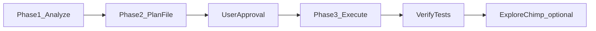

# /testchimp upkeep

**Synonym:** `/testchimp evolve` (same workflow **`upkeep`** — use either prompt). Legacy **`/testchimp audit`** → same.

> **Workflow overlay (skill ≥ 1.0.0)** — **Workflow id:** `upkeep` (canonical prompt `/testchimp upkeep`; synonym `/testchimp evolve`). **Policy:** `plans/knowledge/policies/upkeep.policy.md` (or `--policy` / matching frontmatter; fallback `ai-test-instructions.md`). Default subflows: author-plans → connect-to-test-env → **fix-test-execution** → fix-coverage-gaps → run-explorechimp → cleanup → instrument-truecoverage. **Plan path:** `knowledge/workflow_plans/upkeep/<workflow_execution_id>.plan.md`. After Plan: write → **`upsert-plans-support-file`** (blocking) → user approval (unless `--mode=non-interactive` or policy allows non-interactive) → Execute. Persist **ULID** `workflow_execution_id`; on mutating actions call **`report-agent-action`** (best-effort). **Before treating the run as done:** [Report workflow execution](./policies-and-traceability.md#report-workflow-execution) (reconcile ledger → emit missing reports → `ACTION_COMPLETED` with `WORKFLOW` + `upkeep`). Details: [`policies-and-traceability.md`](./policies-and-traceability.md).

Systematically improve **requirement coverage**, **execution health**, **TrueCoverage** (real usage vs automated tests), and—when in scope—**targeted ExploreChimp UX analytics** on critical UI slices informed by those signals. This is **not** a passive review: the agent is responsible for **running and maintaining the QA surface area** of the project—seed and probe endpoints, mocks, fixtures, SmartTests and API tests, TrueCoverage instrumentation, optional **ExploreChimp** runs on high-impact journeys, and test-plan artifacts (user stories / scenarios) where the product is under-specified.

---

## Purpose and outcomes

- **Bridge signals:** (1) what the product *should* do (requirements / scenarios), (2) what tests *actually* test (execution history), (3) what users *really* do (TrueCoverage event emits in Production), (4) optional **UX risk** on the same slices via **ExploreChimp** (DOM, screenshot, console, network, metrics) along **SmartTest pathways** that reach those areas—see [ExploreChimp in evolve](#explorechimp-in-evolve-truecoverage-to-targeted-ux-runs).
- **Optimize for business impact:** Prefer gaps where analytics show **high frequency**, meaningful **drop-off**, **depth** in funnels (top-of-funnel being higher priority), or **duration** / **high-demand** events (where users engage a lot or paths are hot). When the platform exposes histograms or time series, use **percentile-style** reading (e.g. p90) alongside averages—wording should match what the API returns; do not invent metrics. Prefer percentiles over averages. Use those same signals to **prioritize which UI tests** to run with **`EXPLORECHIMP_ENABLED`** so UX bugs surface where real usage and risk concentrate.
- **Coverage semantics (strict):** Treat TrueCoverage gaps as "tests are not traversing those emitted business paths/slices yet." Do not misstate this as a missing test-link instrumentation issue when `installTestChimp()` is already wired in `fixtures/index.js` (default scaffold path).

---

## Tooling

- **MCP:** Same tools as in **SKILL.md** (coverage & execution, TrueCoverage analytics, planning). JSON request bodies use **camelCase** field names. **ExploreChimp** runs use Playwright + env vars (not an MCP “run exploration” tool)—see [`run-explorechimp.md`](./run-explorechimp.md).
- **CLI:** [`cli.md`](./cli.md) — `testchimp get-requirement-coverage`, `get-execution-history`, `fetch-execution-report`, TrueCoverage subcommands, etc. Prefer **`--json-input`** (or `@file.json`) for nested bodies such as **`baseExecutionScope`** / **`comparisonExecutionScope`**.
- **Authentication:** Export **`TESTCHIMP_API_KEY`** in the shell that runs the CLI **and** any Playwright/Mobilewright child process using **`@testchimp/playwright`** (see **`SKILL.md`** Preamble **#4** / **cli.md** — agent shells often do not inherit IDE MCP env).

---

## Prerequisites

1. **Mapped plans root:** Resolve **`<MAPPED_PLANS_ROOT>`** as the directory containing the **`.testchimp-plans`** marker (same rule as **`/testchimp test`** plan persistence in **SKILL.md**). All evolve plan files live under that root.
2. **TrueCoverage:** Skip TrueCoverage **Analyze** steps **only** when **`### TrueCoverage Plan`** **explicitly** records **opt-out / disabled**. If the section is missing, empty, or only says **deferred**, treat TrueCoverage as **in scope** and follow **`ExecutionScope`** and metadata rules in [`instrument-truecoverage.md`](./instrument-truecoverage.md).
3. **Guardrails:** Story/scenario IDs and MCP ordering follow **SKILL.md** → Agent guardrails and [`author-plans.md`](./author-plans.md) (**create → write with `id:` → update**; never omit `id:`).
4. **Environment contract (strict, before planning):** Before starting **Analyze** or authoring the evolve plan, read `plans/knowledge/ai-test-instructions.md` and extract the project's pre-agreed environment decision points from **`## Environment Provision Strategy`** (for example local spin-up, Bunnyshell/EaaS, or staging/branch environment rules). Use that guidance to shape the plan and execution ordering. Re-read the same sections again immediately before any test authoring/execution work, and follow them exactly (no improvised target URLs or provisioning flow).
5. **Global policy (suite goals / size / tags):** Read **`plans/knowledge/policies/global.policy.md`** (or **`get-policy --policy-file-name global.policy.md`**) before Analyze when planning growth **or** authoring/updating tests. Honor **coverage target**, **prioritization signals**, and **test suite management** limits. Call **`get-suite-execution-stats`** (see [`cli.md`](./cli.md); prefer **`@testchimp/cli@latest`** until published on a pinned CLI). **Notify the user** when estimated full-suite duration / test count is **over or within ~10%** of **`max_full_suite_duration_minutes`** / **`max_test_count`** (treat **`0`** as unlimited) — soft hint, not a hard blocker. Prefer **pruning** / consolidating obsolete or duplicate tests ([`cleanup.md`](./cleanup.md)) over unbounded growth; respect **`max_new_tests_per_workflow_execution`** when set. When **`scenario_priority`** is on, use weighted coverage (H=5, M=3, L=1). Soft-gate **API contract** / **TrueCoverage** analyze via **`get-org-capabilities`** when **`api_contract_coverage`** / **`real_user_behaviour_coverage`** signals are on (same soft-skip rules as [Org capabilities](#org-capabilities-soft-gate--call-before-truecoverage--api-operation-analyze) below). **Suite tags:** for every new/changed SmartTest, apply Playwright `tag: '@…'` from **`## Test suite management` → `tags:`** using each entry’s **`instructions`** (default `@smoke` / `@regression`) — see [`write-smarttests.md`](./write-smarttests.md) §6b and [`policies-and-traceability.md`](./policies-and-traceability.md)#global-policy--suite-tags-required-when-authoring-tests. Never emit `{ type: 'group' }`.

---

## Phase overview


```mermaid
flowchart LR
  analyze[Phase1_Analyze]
  planFile[Phase2_PlanFile]
  approval[UserApproval]
  execute[Phase3_Execute]
  verify[VerifyTests]
  explore[ExploreChimp_optional]
  analyze --> planFile
  planFile --> approval
  approval --> execute
  execute --> verify
  verify --> explore
```

**ExploreChimp** is **optional** per evolve plan and user agreement; when omitted, tick **`N/A`** on the plan.

---

## Phase 1 — Analyze (read-only)

**Goal:** Collect evidence from TestChimp (default analytics scope unless the user asks for a specific branch). **Do not** change application code or write the evolve plan file yet beyond rough notes if needed.

**Mandatory pre-step:** Re-open `plans/knowledge/ai-test-instructions.md` first and confirm the environment provisioning strategy for this run (how to provision, which URL source of truth to use, and what "healthy" means). Do this before any analytics-driven planning so later test authoring runs against the agreed environment strategy.

### Org capabilities (soft gate — call before TrueCoverage / API operation analyze)

Call **`get-org-capabilities`** (CLI ≥ **0.1.29**; see [`cli.md`](./cli.md) § `get-org-capabilities`) once at the start of Phase 1 and read **`capabilities[]`** + **`freeTrialActive`**:

- **`TRUE_COVERAGE`** missing **and** `freeTrialActive: false` → **skip** the [TrueCoverage](#truecoverage-when-enabled) analyze subsection this cycle: mark it **`N/A`** with reason "TrueCoverage capability not enabled for this org" in the Phase 1 gate and the plan file. Do **not** call the TrueCoverage MCP tools.
- **`API_CONTRACT_COVERAGE`** missing **and** `freeTrialActive: false` → **skip** the [API operation coverage](#api-operation-coverage-fix-coverage-gaps--new-tests) analyze subsection this cycle: mark it **`N/A`** with reason "API contract coverage capability not enabled for this org". Do **not** call `list-api-operation-services` / `list-api-operations` / `get-api-operation-detail`.
- **Either capability present, or `freeTrialActive: true`** → run that subsection as documented below.
- **Continue regardless:** a gated capability only skips its **own** subsection — requirement coverage, execution history, and all other Phase 1 work proceed normally. Never abort the `upkeep` run because a capability is off.
- **If `get-org-capabilities` fails** (network/auth) — proceed with both subsections as normal (fail open); note in the plan that the capability check could not be confirmed.

### Default branch / scope

- Unless the user specifies a Git branch for analytics, **omit `branchName`** from coverage and execution requests so results aggregate across branch copies (unscoped coverage). Pass **`branchName`** only when analytics must be limited to one Git branch.
- For **test authoring** in evolve, use **`get-requirement-coverage`** top-N gaps (below). Eligibility = present in **`rankedScenarios`** (no parent-story gate). Server excludes **`verification_strategy: manual`** by default — do not document/require a verification knob in global policy for agents. Prefer parent story not **`archived`**. Confirm edge cases with **`get-spec-lifecycle-details`** when needed (no “branch-implemented + validated” shortcut from `/testchimp test` Analyze).
- Reuse the same optional **`scope.folderPath`**, **`scope.filePaths`**, **`environment`**, **`release`** filters when comparing apples to apples across tools.

### TrueCoverage (when enabled)

Skip this subsection (mark **`N/A`**) when the project has an **explicit** opt-out per [Prerequisites](#prerequisites) **or** the org **`TRUE_COVERAGE`** capability is off per [Org capabilities](#org-capabilities-soft-gate--call-before-truecoverage--api-operation-analyze) above.

See **`ExecutionScope`** in [`instrument-truecoverage.md`](./instrument-truecoverage.md) and wire shapes in [`cli.md`](./cli.md) § TrueCoverage:

- **`baseExecutionScope`** — real-user / primary environment (frequency, funnels, impact).
- **`comparisonExecutionScope`** — where automated tests run; set **`automationEmitsOnly: true`** on comparison (and on **`coverage_scope`** when drilling) so “covered” means **test-tagged emits only**. Before calling those, call list_rum_environments to get the list of environments - so that you know what env to set for base and comparison scopes.
- **`platform`** on each scope (**`WEB_EXECUTION_PLATFORM`**, **`IOS_EXECUTION_PLATFORM`**, **`ANDROID_EXECUTION_PLATFORM`**) when the repo ingests multiple RUM platforms — e.g. compare prod **iOS** real users to **QA** **iOS** automation only.
- Every scope needs **`environment`** + nested **`timeWindow`** (e.g. `"timeWindow":{"relativeWindow":"604800s"}`). Prefer CLI flags when possible: `testchimp get-truecoverage-events --environment QA --relative-window 604800s` (requires `@testchimp/cli` ≥ **0.1.11**). Do **not** send flat `relativeWindow` on the scope.

**Suggested order:**

1. **`list-rum-environments`** — pick environment tags for scopes.
2. **`get-truecoverage-events`** — `baseExecutionScope` + optional `comparisonExecutionScope` (each with nested `timeWindow`).
3. For high-impact or unclear events: **`get-truecoverage-event-details`**, **`get-truecoverage-child-event-tree`**, **`get-truecoverage-event-transition`**, **`get-truecoverage-event-time-series`**.
4. **`get-truecoverage-event-metadata-keys`** / **`get-truecoverage-session-metadata-keys`** — validate slicing dimensions (including **dot-scoped** entity metadata per [`instrument-truecoverage.md`](./instrument-truecoverage.md) → *Dot-scoped metadata*).

### Requirement coverage

- Call **`get-requirement-coverage`** as a **top-N gap recommender**. Expand **`global.policy.md`**:
  - **Coverage target → `lifecycle_status`:** **`ready`** → `--lifecycle-statuses ready`; **Draft+** / `lifecycle_status: draft` → `--lifecycle-statuses draft,ready`.
  - **Prioritization signals:** `scenario_priority: true` → `--consider-scenario-priority`; `semantic_coverage: true` → `--consider-semantic-coverage` (accepted; server ignore in v1).
  - Always set **`--limit`** (e.g. 20) and **`includeNonCoveredUserStories` / `includeNonCoveredTestScenarios`: true**.
  - Prefer response **`rankedScenarios`** as the work queue (eligibility = present there — server returns **gaps only**, including partial multi-platform `NOT_ATTEMPTED` rows). Nested `userStories` is for tree views only.
- **Ready-only empty / inadequate fallback:** When policy is **`lifecycle_status: ready`** and the first query returns **empty** `rankedScenarios` (or clearly inadequate vs `--limit` / expected gaps — e.g. zero uncovered candidates while the suite has draft scenarios), **retry once** with Draft+ (`--lifecycle-statuses draft,ready`). Note in the plan that results include draft scenarios (users may have forgotten to flip status to ready). Prefer still targeting **ready** first when both are present; when only drafts appear, call that out and optionally suggest promoting them to ready. Do **not** broaden further (no blocked/archived). If policy is already Draft+, no second query.
- On **mobile** or **multi-platform** projects, read **per-platform** rows (`platform`: web / ios / android) — a scenario can be covered on iOS but not Android. Omit **`platform`** to see all expected platforms; pass **`platform`: `ios`** or **`android`** to focus one stack ([`cli.md`](./cli.md) § Platform execution reporting). Requires ingested runs from **`@testchimp/playwright` ≥ 0.2.0**.

### Signal-only gaps (API / TrueCoverage) — check existing first

Applies when Analyze/Plan proposes **new** scenarios/stories from **API operation** or **TrueCoverage** signals (and the same rule for standalone **`/testchimp create tests for …`** — see [`create-tests.md`](./create-tests.md) / [`api-testing.md`](./api-testing.md)):

1. **Before proposing new plan items:** search existing scenarios/stories (mapped `plans/`, MCP `get-test-scenarios` / coverage / semantic-nearby if useful) for a match to the signal (same journey, operation, field, or event path). Prefer linking an **existing** scenario when one fits.
2. Only when **no suitable scenario exists**, propose new scenario(s) — and a parent **story** only if no relevant story exists (link to an existing story when one fits). Record titles, rationale, linked signal, and that the existence check found none.
3. **Explicit user approval** before creating any new story/scenario (composite upkeep approval). Do not create plan entities on a silent path.
4. Execute: create **only the approved missing** items with lifecycle **`ready`** + verification **`auto`** (signal implies implemented), then author SmartTests against existing or newly created scenarios (scenario `annotation` links).
5. No phantom ids; never create a duplicate scenario when an existing one already covers the gap.

### Suite size (soft hints)

Call **`get-suite-execution-stats`** and compare to **`max_full_suite_duration_minutes`** / **`max_test_count`** / **`max_new_tests_per_workflow_execution`**. If over or **close** (e.g. within ~10% of a non-zero cap), **inform the user**. Not a hard blocker — sizing are hints so the user stays aware. Prefer prune/consolidate suggestions when informing ([`cleanup.md`](./cleanup.md)).

### Execution history

- **`get-execution-history`** with the same scope shape — flakiness, failures, error patterns.
- For a specific scenario, use **`scenarioId`** (platform UUID) plus optional **`platform`** or **`dimensionFilters`** to inspect device-level runs ([`write-smarttests.md`](./write-smarttests.md)).

### Recently failing tests (`fix-test-execution`)

**Goal:** Discover SmartTests whose **latest** ingested run is a failure, pull structured failure reasons from the platform, and draft concrete fix (or product-bug) work for the evolve plan. This is the Analyze half of the default **`fix-test-execution`** subflow — Execute follows [`fix-test-execution.md`](./fix-test-execution.md) under the parent upkeep plan (no second approval cycle).

**CLI / MCP support (no dedicated “list failing tests” command):**

1. **Discover candidates** — `get-execution-history` with a platform tests scope (default **`--folder-path tests`**, or the scoped folder/files for this run). Omit `--branch-name` unless analytics must be limited to one Git branch. Prefer omitting `--environment` so history is not env-scoped. Server default time window is **~30 days** when `timeWindow` is omitted.

   ```bash
   testchimp get-execution-history --folder-path tests
   ```

   MCP: `get-execution-history` with `{ "scope": { "folderPath": "tests" } }`.

2. **Select recently failing tests** from the response:
   - Group `records[]` by `testId`.
   - Take the **latest** record per test (`executionStartTimestampMillis` / job timestamp descending).
   - Keep tests whose latest `status` is **`SMART_TEST_EXECUTION_FAILED`** (also treat chronic failures via `testStats[].failCount` when useful).
   - Cap to a high-ROI set for this cycle (shared error signatures first; avoid unbounded N one-offs). If none → mark **`N/A`** in the plan.

3. **Get failure reasons** — for each selected failing run, call **`fetch-execution-report`** with that record’s **`executionJobId`** (as `--job-id` / `jobId`). Returns only failing tests with `errors[]`, `testFilePath`, and `traceViewerUrl` when available.

   ```bash
   testchimp fetch-execution-report --job-id "<execution-job-id>"
   ```

   If the user (or CI) already provided a **`batchInvocationId`**, prefer one batch call: `fetch-execution-report --batch-invocation-id "<id>"` instead of per-job calls.

4. **Per-test history (required before planning fixes)** — for each failing `testId` (or one representative per error cluster):

   ```bash
   testchimp get-execution-history --test-id "<test-uuid>"
   ```

   Use the top ~5 runs to distinguish flake vs chronic failure (same rules as [`fix-test-execution.md`](./fix-test-execution.md) §2b).

5. **Triage into the plan** — classify each failure/cluster as **test incorrect** vs **product broken** ([`fix-test-execution.md`](./fix-test-execution.md) §2c). Record hypothesized causes, shared root causes, and proposed actions (test/infra fix vs issue filing) in Phase 2 section **6**.

### API operation coverage (`fix-coverage-gaps` / New tests)

Skip this subsection (mark **`N/A`**) when the org **`API_CONTRACT_COVERAGE`** capability is off per [Org capabilities](#org-capabilities-soft-gate--call-before-truecoverage--api-operation-analyze) above.

When OpenAPI roots are configured for the project (Operations / API coverage):

1. **`list-api-operation-services`** — if empty, record **`N/A`** (OAS not configured).
2. **`list-api-operations --root-file-path <path>`** — prioritize low `coverageSummary.coverageScore`, zero covering tests, business-critical paths.
3. **`get-api-operation-detail`** on top gaps — pick high-ROI uncovered request/query/response fields and response codes.
4. Prioritize: **missing coverage** + **business criticality** + **likely distinct backend branch complexity** (auth/role gates, pagination, status enums, error paths, nested secondary loads — not only filters). See [`api-testing.md`](./api-testing.md).
5. Close gaps by **updating existing tests** and/or **authoring new ones** (UI SmartTests that hit the API count). Prefer extending an existing journey; a dedicated `api/` test is one option, not the default. Invoke create-tests patterns via [`create-tests.md`](./create-tests.md) / [`api-testing.md`](./api-testing.md).

### ExploreChimp in evolve: Targeted UX bug checks

**Goal:** Turn **TrueCoverage insights** into a **short list of UI SmartTests** to run with **`EXPLORECHIMP_ENABLED`**, so **UX issues** (performance, layout, visual, usability, accessibility, console/network noise) are surfaced on **critical product slices**—not random pages.

**How to pick tests (read-only in Phase 1; commit choices in Phase 2):**

1. From **TrueCoverage** outputs, identify **high-impact UI-related signals**: e.g. **funnel drop-offs**, **high-duration** events, **high-demand** / high-frequency steps, transitions with sparse automation coverage (**`comparisonExecutionScope`** with **`automationEmitsOnly: true`** vs base—see [`instrument-truecoverage.md`](./instrument-truecoverage.md)).
2. **Map events to product areas** (routes, features, entity metadata slices) using event titles, metadata keys, transition trees, and time series—same mental model as fixture/test planning.
3. **Find or plan SmartTests** that **drive the browser through those areas** with stable **`markScreenState`** checkpoints ([`write-smarttests.md`](./write-smarttests.md), Phase 4 / atlas rules in [`run-qa.md`](./run-qa.md)). Prefer **existing** specs that already reach the slice; if the evolve plan adds **new** tests for under-covered slices, those **new tests are valid exploration vehicles** once they pass and markers exist.
4. **Defer or `N/A`:** Pure **API-only** gaps, **explicit TrueCoverage opt-out**, or no UI surface for the signal—document in the evolve plan.

Full operator checklist, env vars, and **`ai-test-instructions.md` → `## ExploreChimp`**: [`run-explorechimp.md`](./run-explorechimp.md).

### Phase 1 gate (before Phase 2)

Do **not** open Phase 2 until **all** are satisfied. Same bar as [`init-testchimp.md`](./init-testchimp.md) and [`run-qa.md`](./run-qa.md): each line **done** or **`N/A`** + **one-line justification** (record in chat or draft notes for the plan file).

- [ ] `get-org-capabilities` checked (or noted as failed/skipped) so TrueCoverage / API operation subsections below reflect **`TRUE_COVERAGE`** / **`API_CONTRACT_COVERAGE`** gating.
- [ ] TrueCoverage subsection **skipped intentionally** (**explicit** opt-out in `### TrueCoverage Plan` + user OK, **or** `TRUE_COVERAGE` capability off — see [Org capabilities](#org-capabilities-soft-gate--call-before-truecoverage--api-operation-analyze)) **or** scopes chosen and at least one pass of **`get-truecoverage-events`** completed.
- [ ] Requirement coverage pulled with gap-friendly flags **or** scoped intentionally narrow with user direction.
- [ ] Execution history reviewed for the same scope/time mental model.
- [ ] **Recently failing tests:** `get-execution-history` (folder/file scope) → latest-failing filter → `fetch-execution-report` for failure reasons → per-`testId` history for clusters — **or** **`N/A`** (no recent failures in scope).
- [ ] API operation coverage reviewed via `list-api-operation-services` / `list-api-operations` (or **`N/A`** — OAS not configured, **or** `API_CONTRACT_COVERAGE` capability off) and top gaps noted for New tests / `fix-coverage-gaps`.
- [ ] Short list of **top gaps** and **signals** (what data justified priority) , and an executive summary of the targets, is ready to paste into the plan file.
- [ ] **ExploreChimp targeting:** candidate UI specs (or **`N/A`**) mapped from TrueCoverage / execution signals per [ExploreChimp in evolve](#explorechimp-in-evolve-truecoverage-to-targeted-ux-runs)—final yes/no and scope still belong in **Phase 2** with user approval.

---

## Phase 2 — Plan (persisted plan file only)

**Goal:** Produce a **durable** evolve plan: rationales, checklists, and links—**no** product code changes in this phase.

### Written artifact (mandatory)

Create:

**`<MAPPED_PLANS_ROOT>/knowledge/workflow_plans/upkeep/<workflow_execution_id>.plan.md`**

- **`<YYYY-MM-DD>`** — ISO calendar date for the evolve run.
- **`<nn>`** — two-digit dedupe index: `01` for the first plan that day, `02`, `03`, … if multiple evolves run the same day.

**Required YAML frontmatter:**

```yaml
---
workflow_id: upkeep
workflow_execution_id: <ulid>
LastRunOnCommit: <git-sha>
PlanApproved: pending
ApprovedBy:             # "auto" when --mode=non-interactive
---
```

After writing the plan file, call **`upsert-plans-support-file`** with `filePath: knowledge/workflow_plans/upkeep/<ulid>.plan.md` and full content (**blocking** before Execute). See [`policies-and-traceability.md`](./policies-and-traceability.md).

When the prompt includes **`--mode=non-interactive`**: set `PlanApproved: yes` + `ApprovedBy: auto`, re-upsert, **do not** wait for chat approval, Execute, then **open a PR**.

### Plan template (required sections)

Each section should include **rationale** (why it matters for this run) and a **markdown checklist** of concrete action items.

1. **Analysis summary** — Bullets: key signals (TrueCoverage, requirements, execution / recent failures), top risks, what surprised you.
2. **TrueCoverage instrumentation** — Read the **existing** **`plans/knowledge/truecoverage-instrument-progress.md`** first: it holds **pre-identified** work, including items that are **planned but not yet implemented**. In this evolve cycle, **choose from that backlog** (and add any newly discovered gaps from Phase 1), ordered by **business priority** as you judge. Then list concrete work: new or updated event **titles** and **metadata** (web: **`testchimp.emit`**; iOS/Android: **`TestChimpRum.emit`** or equivalent) with **dot-scoped** entity keys where applicable ([`instrument-truecoverage.md`](./instrument-truecoverage.md)). Link/update **`plans/knowledge/truecoverage-instrument-progress.md`** and **`plans/events/*.event.md`** as items land or status changes. Every **`*.event.md`** must include a **`## Rationale`** body section (instrumentation intent, hypotheses, business criticality, scenario/story links) so later MCP analysis stays tied to planning context—see **Event documentation** in [`instrument-truecoverage.md`](./instrument-truecoverage.md).
3. **Seed / probe endpoints and mocks** — Endpoints or **`page.route`** / AIMock changes needed to support new world-states of entities identified and untested.
4. **Fixtures** — Playwright fixture work tied to **observed metadata slices** (e.g. users without FOP if production shows that slice on checkout).
5. **New tests** — SmartTests / API tests; prioritize by **`rankedScenarios`** (requirement gaps) + API / TrueCoverage signals + business criticality. For signal-only gaps, follow [Signal-only gaps](#signal-only-gaps-api--truecoverage--check-existing-first) (check existing scenarios/stories first; propose missing as **`ready`** + **`auto`** only after approval). Prefer updating existing tests that already touch an under-covered operation when possible ([`api-testing.md`](./api-testing.md)). For each new test, note suite tags from **`global.policy.md`** (e.g. `@smoke`) and apply them when authoring. Include suite-size soft notify from **`get-suite-execution-stats`** when over/near caps.
6. **Recently failing tests (`fix-test-execution`)** — From Phase 1 discovery: list each failing test (name, `testId`, `jobId` / batch id, file path), failure summary (`errors[]` / report), flake vs chronic from `--test-id` history, triage (**test incorrect** vs **product broken**), and a checklist of fix or issue actions. Prefer shared root-cause fixes over N one-offs. Mark **`N/A`** when no recent failures. Execute via [`fix-test-execution.md`](./fix-test-execution.md) nested under this plan.
7. **Updates to existing tests** — Behavior drift, reporter/scenario links; also extend journeys to close high-ROI API field/code gaps (non-failure maintenance). When touching a test, add missing suite tags from **`global.policy.md`** if configured, and migrate leftover `{ type: 'group' }` annotations to tags.
8. **Planning debt** — User stories / scenarios for under-specified areas (create via MCP per guardrails before writing traced tests).
9. **ExploreChimp (targeted UX exploration)** — Whether to run **ExploreChimp** this cycle; **which UI specs** (existing and/or **new** SmartTests from section 5 once implemented); how each choice ties to **TrueCoverage** signals (drop-off, duration, demand, automation gap). Record **`N/A`** when opt-out, API-only cycle, or user declines extra runtime. Require **user agreement** for **yes** (same bar as infra cost). Execution detail: [`run-explorechimp.md`](./run-explorechimp.md); persist regex/source decisions under **`plans/knowledge/ai-test-instructions.md` → `## ExploreChimp`**.

For section 2, apply this guardrail:

- If events already exist in production and are visible in TrueCoverage, do **not** add extra linking instrumentation for tests when runtime wiring already uses `installTestChimp()` in fixtures.
- Treat under-covered events as a **test coverage problem** first: add/update business-sensible scenarios and tests that traverse those event paths.
- Use metadata breakdowns to target high-priority slices (role/tier/state/etc.) with scenario-driven tests, not synthetic one-off event touches.

### Phase 2 gate (before Phase 3)

Do **not** ask for user approval to implement until **all** are satisfied (each **done** or **`N/A`** + one-line justification where a gate line does not apply):

- [ ] Plan file exists at **`knowledge/workflow_plans/upkeep/<workflow_execution_id>.plan.md`** under **`<MAPPED_PLANS_ROOT>`**.
- [ ] **`upsert-plans-support-file`** succeeded for that relative path (blocking before Execute).
- [ ] Frontmatter includes `workflow_id`, `workflow_execution_id`, `LastRunOnCommit`, `PlanApproved` (and `ApprovedBy: auto` when `--mode=non-interactive`).
- [ ] All **nine** sections above are present (use “N/A” with one-line rationale if a section is empty).
- [ ] Section **6** lists concrete failing tests + failure reasons + triage (or **`N/A`** — no recent failures).
- [ ] Each section has a **checklist** the agent will tick during execution.
- [ ] Links to **`plans/knowledge/truecoverage-instrument-progress.md`** / **`plans/events/`** included when TrueCoverage work exists (including when pulling from the planned-not-yet-implemented backlog).

---

## Phase 3 — Execute (implementation)

**Goal:** Implement the plan, verify tests, and record completion.

### Hard gate: explicit user agreement

- **Do not** start implementation until the user **explicitly agrees** to the written plan (e.g. confirms in chat or asks to proceed) — **unless** the prompt has **`--mode=non-interactive`** (auto-approve with `ApprovedBy: auto`, then Execute + open a PR) **or** policy `allow-execute-without-approval`. Paste a **short summary** + path to **`knowledge/workflow_plans/upkeep/<workflow_execution_id>.plan.md`** when asking (interactive only).

### Git workflow

- If the current branch is the repo **default** branch (**`main`**, **`master`**, or team convention): in **interactive** mode **ask** whether to create a **feature branch** before coding; in **`--mode=non-interactive`**, **create** a feature branch without asking (e.g. `testchimp/upkeep-<short-ulid>`).
- Implement on the agreed/created branch; push and open PR when the user wants review — **or always open a PR** when `--mode=non-interactive` produced commits.

### Implementation order (typical)

Follow this **order** when coding (dependencies first):

0. **`@testchimp/playwright` upgrade (autonomous)** — Before fixtures, tests, or runner use: bring **`@testchimp/playwright`** to **npm latest** at the Playwright install root; commit **`package.json` + lockfile** when bumped. Procedure: [`create-tests.md`](./create-tests.md) → *`@testchimp/playwright` upgrade*; **SKILL.md** Preamble **#8**. Nested **create-tests** / gap-fix authorship skips if this step already completed for the same `workflow_execution_id`.
1. **System infra** — Instrumentation, **`plans/events/`**, **`plans/knowledge/truecoverage-instrument-progress.md`** (and related trackers); backend seed/probe endpoints as needed.
2. **Test plan updates** — User stories / scenarios (new or revised).
3. **Test infra** — Fixtures, mocks (including fixes shared by failing-test clusters).
4. **Fix recently failing tests (`fix-test-execution`)** — When section **6** is not **`N/A`**: apply the approved triage/fix checklist using [`fix-test-execution.md`](./fix-test-execution.md) (nested: reuse this plan’s `workflow_execution_id`; do **not** open a second Plan → approve cycle). Re-run only the tests that were supposed to be fixed; file product-broken issues only after approval rules in that playbook.
5. **Test updates / new tests** — Remaining updates to existing tests (section **7**); then new tests (section **5**).
6. **ExploreChimp (optional, plan-gated)** — When section **9** is not **`N/A`**: after **new/changed UI tests pass** and **`markScreenState`** / atlas work for those specs is in good shape (same bar as [`run-qa.md`](./run-qa.md) **Validate** for touched flows), run **ExploreChimp** per [`run-explorechimp.md`](./run-explorechimp.md) on the **planned spec list**, using **`TESTCHIMP_BATCH_INVOCATION_ID`**, **`EXPLORECHIMP_ENABLED`**, and persisted **`## ExploreChimp`** settings. **Honor config reporters** (no CLI **`--reporter`**) and **confirm exploration completed** before ticking this item done ([`run-explorechimp.md`](./run-explorechimp.md)#exploration-completion-required). **New tests authored in this evolve cycle** should be included once they are stable exploration vehicles.

### Post-implementation completion checklist (required)

After implementation is **done**, walk the **same buckets** as above and record the outcome in the **workflow plan file** (`knowledge/workflow_plans/upkeep/<workflow_execution_id>.plan.md`) before you treat Phase 3 as finished—same style as the Phase 1 / Phase 2 gates (nothing implied; nothing skipped silently). Append a short **“Phase 3 completion”** block or tick items inline next to the plan checklists. Re-**`upsert-plans-support-file`** after updating the plan.

For **each** bucket below: either mark **done** with a **one-line** summary of what shipped, or write **`N/A`** with a **one-line justification** (why this evolve cycle did not need it).

- [ ] **`@testchimp/playwright` upgrade** — On latest (version noted) or bumped + lockfile committed; **`N/A`** only if npm unreachable (noted) or no SmartTests package in repo.
- [ ] **System infra** — Instrumentation, **`plans/events/`**, progress tracker, seed/probe endpoints.
- [ ] **Test plan updates** — Stories / scenarios touched or explicitly deferred.
- [ ] **Test infra** — Fixtures / mocks.
- [ ] **Recently failing tests** — Section **6** checklist done (test-incorrect fixed + re-run; product-broken reported/filed per rules), or **`N/A`**.
- [ ] **Test updates** — Existing tests revised **and** new tests added (or explicit **N/A** if the plan truly had no test-code delta—justify).
- [ ] **ExploreChimp** — Targeted run completed per plan section **9** with platform exploration **COMPLETED** (not left In progress), or **`N/A`** with justification (e.g. TrueCoverage opt-out, API-only, user declined).

Then complete **Verification** and **Closure** below.

### Verification

- Run **new or changed** tests per **`plans/knowledge/ai-test-instructions.md`** (local vs CI, env bring-up, headed vs headless—follow what the project recorded; consult **`## Past learnings — authoring & validation (FAQ)`** when bring-up or URLs fail—[`run-qa.md`](./run-qa.md#binding-ai-test-instructions-environment-and-faq-playbook)).
- For SmartTest details, see [`write-smarttests.md`](./write-smarttests.md).
- Before **ExploreChimp**, confirm **UI** specs used for exploration have appropriate **`markScreenState`** coverage for the flows you are analyzing (same bar as **Phase 4: Validate** in [`run-qa.md`](./run-qa.md)). In **`/testchimp test`**, **Phase 6** ExploreChimp is **default-on** for UI SmartTest deltas unless branch plan **[§7](./run-qa.md#7-explorechimp-branch-plan-yes-or-documented-na)** records **`N/A`** with rationale; run after **Phase 5: Smart regression** on **new + changed + regression-touched** specs (evolve remains plan-gated per evolve plan section **9**).

### Closure

- Mark the **Phase 2 plan checklists** and the **Phase 3 completion checklist** (above) in the same **workflow plan file** (`knowledge/workflow_plans/upkeep/<workflow_execution_id>.plan.md`)—every bucket **done** or **`N/A`** with justification. Re-upsert via **`upsert-plans-support-file`**.
- Add **commit** and/or **PR** references when available.
- If **ExploreChimp** ran, summarize **which TrueCoverage signals** drove test choice and whether **`## ExploreChimp`** in **`ai-test-instructions.md`** was updated (regex, sources, scope notes).
- **[Report workflow execution](./policies-and-traceability.md#report-workflow-execution)** before finishing (`ACTION_COMPLETED` / `ACTION_FAILED` for `WORKFLOW` + `upkeep`).

---

## Notes

- Requirement coverage depends on **SmartTest ↔ scenario** traceability and reporter-ingested runs.
- **Evolve + ExploreChimp:** TrueCoverage highlights **where users struggle or concentrate**; ExploreChimp applies **UX analytics on the paths SmartTests already exercise**—including **tests added in the same evolve cycle** once they reach those areas with stable **`markScreenState`** markers.
- **`scope.folderPath`** uses **platform** roots (`tests` / `plans`), not only on-disk folder names—see **SKILL.md** → Coverage scope note.
